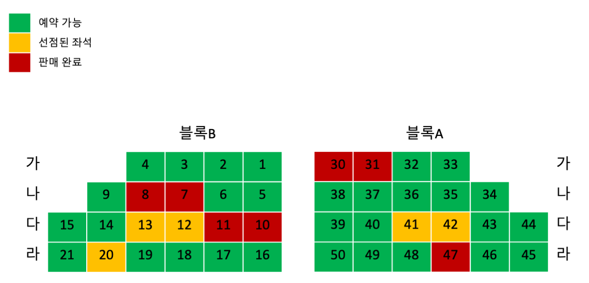

# Performance

이 프로젝트의 목표는 서버에서 대용량 트래픽을 효율적으로 처리하는 과정을 보여주는 것이다.
이를 위한 예제로 '티켓 구매 시스템'을 개발하면서 점진적으로 성능을 개선해 나간다.
최종 목표는 'scale out'으로 아래의 요구사항을 충족하는 것이다.

> -   5만개의 좌석이 존재하는 공연.
> -   좌석도 시스템 사용자 50만 명.
> -   사용자 한 명은 1분에 10번의 좌석을 선택/해제한다.

위의 조건은 만족하려면 아래와 같은 성능이 필요하다.

> -   1분에 50만\*10회 만큼 서버에 업데이트가 이루어져야 한다.
> -   이것은 1초에 8만 번의 업데이트가 발생하는 것이다.(500만/60sec = 84000/sec)
> -   사용자가 좌석 선점 시 현재 상태가 업데이트 되게 한다면 1분에 500만 번의 읽기가 발생한다.
> -   사용자가 좌석 선점 시 다른 사용자에게 바로 상태 업데이트를 한다면 50만/sec 읽기가 발생한다.

왜 이 정도의 수치가 나오는 지는 중요하지 않다. 중요한 것은 정말 많은 리퀘스트가 발생한다는 것이다.

## 좌석도 구조

이 프로젝트의 중요한 도메인은 좌석도(seatmap)이다. 사용자가 티켓을 구매하려면 좌석을 지정해야 한다. 공연 마다 다른 특성을 가지는 좌석 정보를 수용하기 위해서 좌석도의 구조를 다음과 같이 정의한다.

> -   좌석도는 '블록(block)' > '열(row)' > '좌석(seat)'으로 구성된다.
> -   좌석번호(seatnum)는 각 열에서 고유하며 순서는 불규칙하다.
> -   좌석의 상태는 '구매가능(available)' / '선점(hold)' / '판매완료(sold)'가 있다.

아래 좌석도에서 블록 _'A/B'_ 와 열 _'가/나/다/라'_ 를 볼 수 있다.

