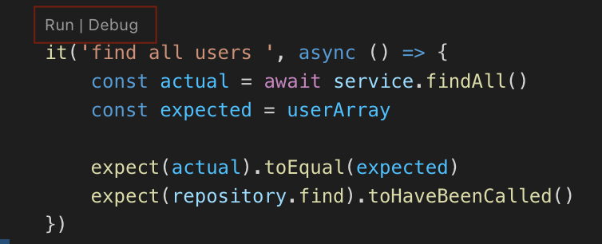

# practice

## Debugging

-   test를 비롯한 모든 디버깅 모드(`node --inspect`)로 실행 중인 프로세스는 `.vscode/launch.json`의 `Attach`를 사용한다.
-   `.spec.ts`에 정의된 테스트는 `npm test`를 하지 말고 각 테스트 항목에서 run/debug를 클릭해서 실행한다.
    

## Running

-   이 프로젝트를 실행하기 위해서 MySQL이 필요하다면 `scripts/bootup_infra.sh`를 실행한다. 이 스크립트를 실행하면 접속 정보 등을 담고있는 `.env.development`가 생성된다.
-   production에서는 `.env.development`를 사용하지 말아라.

## Installation

```bash
$ npm install
```

## Running the app

```bash
# development
$ npm run start

# watch mode
$ npm run start:dev

# production mode
$ npm run start:prod
```

## Test

```bash
# unit tests
$ npm run test

# e2e tests
$ npm run test:e2e

# test coverage
$ npm run test:cov
```

## Support

Nest is an MIT-licensed open source project. It can grow thanks to the sponsors and support by the amazing backers. If you'd like to join them, please [read more here](https://docs.nestjs.com/support).

## Stay in touch

-   Author - [Kamil Myśliwiec](https://kamilmysliwiec.com)
-   Website - [https://nestjs.com](https://nestjs.com/)
-   Twitter - [@nestframework](https://twitter.com/nestframework)

## License

Nest is [MIT licensed](LICENSE).
